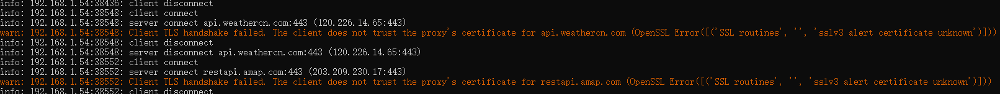
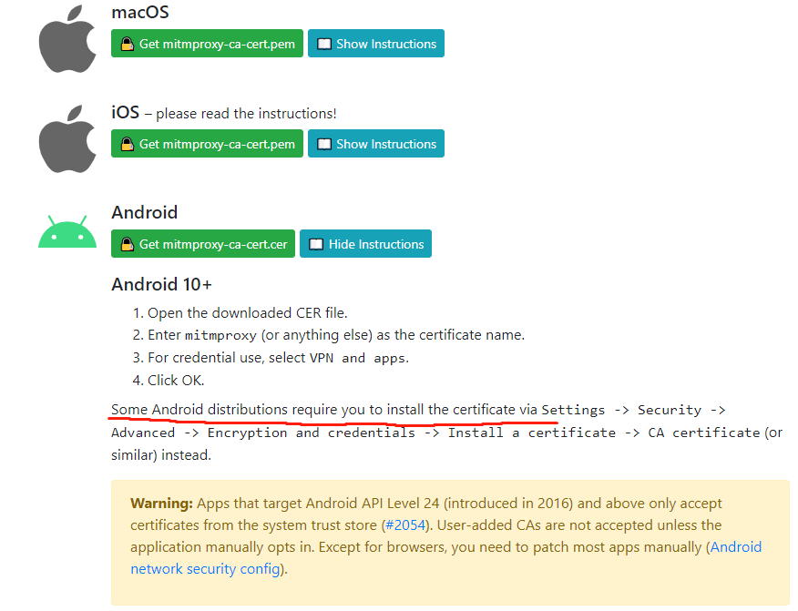

# QuantitativeTransaction

手机app模拟调试环境

| 环境  | 作用  |安装位置| 安装方法|
|---|---|---|---|
| python| 基础  |开发环境|官网安装包
|uiautomator2|Android自动化测试框架<br>提供python接口模拟人的行为与Android交互<br>|开发环境|#pip install uiautomator2
|atx|atx-agent会启动uiautomator2服务进行监听，<br>并将python脚本转换为uiautomator2的代码<br>atx-server可统一纳管多个atx-agent|移动设备|#python -m uiautomator2 init
|weditor|手机app控件定位辅助工具|开发环境|#pip install weditor(注意版本，报错则换版本)
|adb|apk调试工具，usb控制移动设备|开发环境|夜神模拟器bin目录下adb.exe加入环境变量
|夜神模拟器|模拟Android、ios系统|开发环境|官网安装包
## 创建python虚拟环境

<font size=3>1.新建文件夹
>mkdir xxx

>cd xxx

<font size=3>2.下载python工具包virtualenv
>pip install virtualenv

<font size=3>3.创建python虚拟环境
>python -m virtualenv myvirtenv

<font size=3>4.切换到虚拟环境 
>source myvirtenv/bin/activate


<font size=3>4.切换到虚拟环境


## adb调试工具
`前提条件：`usb连通手机，开启开发者模式，打开usb调试

- 查看Android设备
>adb devices

- 查看设备已安装apk

>adb shell pm list packages

- 安装apk

>adb install xxx

- 启动手机端atx-agent服务
>adb shell  /data/local/tmp/atx-agent server -d

## Root手机
`前提条件：`usb连通手机，开启开发者模式，打开usb调试

1.下载root包

2.手机安装supersu手机权限管理工具

3.刷入第三方recovery

<font color=red>注：手机必须是unlocked的才能刷recovery以及获取root权限，所以必须解锁BL</font>
```
eg：华为honor10解锁BootLoader,如今华为官方已关闭获取BL解锁码通道，只能网上（如github）找破解软件破解掉解锁码，这个过程是一个漫长的等待！且有的高版本M系统（如MUEUI10）还不支持unlock command,这时还要系统降级（华为官方手机助手对手机进行降级降到了9）
```

## app抓包环境搭建
### 【安装fiddler】

1.安装fiddler抓包工具（官网：https://www.telerik.com/fiddler ）
  注：选择Fiddler Classic版

2.设置手机网络代理

```
设置--网络--高级--手动--输入fiddler地址和端口（需与fiddler主机连通）
```
3.安装证书
```
#fiddler端在setting中Export root certificate会在桌面生成证书，双击证书安装
#手机端访问fiddler的ip+port进行安装
```
### 【安装mitmproxy】
```
pip install mitmproxy
```

`与python对接进行二次开发`官方文档：https://docs.mitmproxy.org/stable/

   <font color=red>注：这里二次开发并不是在uiautomator2开发的py文件中编写mitmproxy抓包逻辑，而是单独的脚本文件，在mitmproxy服务启动时-s作为启动项加载</font>

- 启动mitmproxy服务
  >cmd/ mitmproxy

- 设置代理（端口：8080）
  >pc端设置浏览器代理

  >移动端设置网络代理
- 安装证书
  <br>访问： http://mitm.it 
  出现如下页面<br>
  
  ```
  打开mitm.it，显示If you can see this, traffic is not passing through mitmproxy.
  未配置代理
  ```
- mitmproxy快捷键

  |快捷键|说明|
  |---|---|
  |?|帮助文档|
  |q|返回/退出程序|
  |b|保存response body| 
  |f|输入过滤条件|
  |space|翻页|
  |enter|进入接口详情|
  |z|清屏|
  |E|查看日志|
  |e|编辑|
  |r|重新请求|
  |:|执行command|

- TLS证书问题

  mitmproxy 有一套完整的机制处理 HTTPS 加密问题，这套机制能帮助我们解密 HTTPS 流量。[How mitmproxy works](https://docs.mitmproxy.org/stable/concepts-howmitmproxyworks/) 介绍了这套机制的原理。

  因此，当我们在 mitmproxy 的 log 信息中看到这样的错误时，一般的原因是没有正常安装并信任根证书。
  >`10.42.0.45:50438: Client Handshake failed. The client may not trust the proxy's certificate for xxx.com.`

  配置客户端代理后访问 http://mitm.it 即可下载根证书，然后手动信任即可。[About Certificates](https://docs.mitmproxy.org/stable/concepts-certificates/) 文档详述了方法。

  但如果客户端已经正常进行了证书安装，还是碰到这样的提示:
  就应该考虑是否碰到了 Certificate Pinning ，也叫做 HPKP 。在这种情况下，客户端并不会信任位于根证书域中 mitmproxy 下发的证书，而是仅仅信任自己的证书签发机构签发的证书。

  Certificate Pinning 是一种 HTTPS 扩展行为，采用 HSTS 机制实现，一些新的浏览器支持这种行为。当然，自行编写的客户端也可以自行支持这种行为。

  手机检查证书是否安装：
   Settings -> Security -> Certificates -> 'User'-section should now list the certificates you have just installed.

    
   

  Android证书安装：

  

  `Warning`中提到特定Android版本的app只接受系统证书而不接受用户证书，这种情况除非手动设置应用。

  证书锁定(钉扎)Certificate Pinning技术：

  在中间人攻击中，攻击主机通常截断客户端和服务器的加密通信。攻击机以自己的证书替代服务器发给客户端的证书。通常，客户端不会验证该证书，直接接受该证书，从而建立起和攻击机的安全连接。这样，客户端发送的数据，都会被攻击机获取和解密。

  证书锁定Certificate Pinning是SSL/TLS加密的额外保证手段。它会将服务器的证书公钥预先保存在客户端。在建立安全连接的过程中，客户端会将预置的公钥和接受的证书做比较。如果一致，就建立连接，否则就拒绝连接。

  Certificate Pinning在手机软件中应用较多。因为这些应用连接的服务器相对固定，可以预先将服务器的X509证书或者公钥保存在App中。例如，苹果应用商店Apple App Store就预置了这个功能。当使用中间人工具或者Fiddler之类的工具拦截数据，就会造成应用商店无法联网的情况。

  在渗透测试中，遇到这类技术，有二种解决办法。第一种是从系统层面禁用证书锁定验证功能。第二种是反编译软件，将其保存的公钥替换为攻击机的证书。

  PS：如果在手机上采用第一种或者第二种方式，就需要手机root或者越狱。


## app无法抓包 

- app限定了系统代理接口
```
方案一：安装xposted框架
方案二：proxydroid(需root)
方案三：Packet Capture(无root抓包、但无法python交互) 
```
- app启用了ssl-pinning技术防止中间人攻击(客户端验证证书)
```
JustTrustMe插件(安装进xposted框架中)
```
- app采用了双向证书绑定技术(客户端服务端都验证证书)
```
无解：只能找app版本漏洞，逆向看app数据接口
```


### json在线解析
>浏览器输入json.cn
